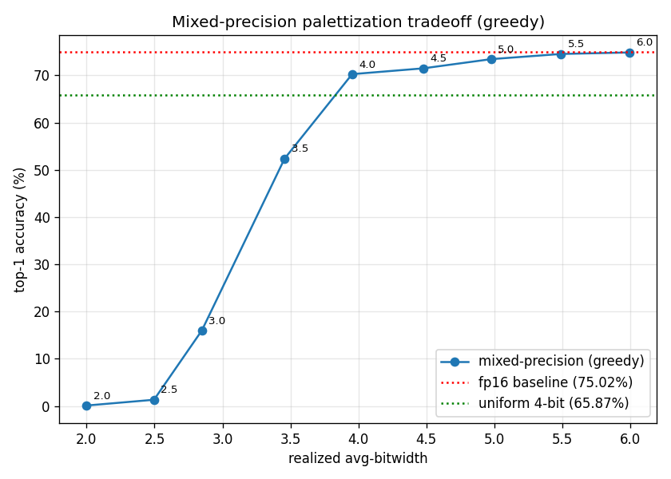

# Mixed-precision palettization with ResNet50

In this article we walk through the [Mixed-Precision Compression](../utils/mixed_precision.md) workflow applied to ResNet50 weight palettization. We use 2/4/6-bit per-tensor palettization as our candidate configs, PSNR on logits as the sensitivity metric, and generate the recipe with the greedy approach targeting 4 bits-per-weight (BPW). See the linked page for definitions of each term and the three-stage workflow.

## Model and dataset

We apply palettization to a pretrained [ResNet50](https://pytorch.org/vision/stable/models/generated/torchvision.models.resnet50.html#torchvision.models.resnet50) (`IMAGENET1K_V1` weights) from torchvision.
The model has 54 conv and linear layers — these are the weights we palettize.
We draw data samples from the ImageNet validation set: 2560 images for sensitivity computation and the full 50,000-image validation set for top-1 evaluation. All accuracy numbers reported below are measured using PyTorch with `mps` backend.

## Baseline

The pretrained model at fp16 gives us a top-1 eval accuracy of `75.02%`.

## Uniform 4-bit palettization

The simplest compression strategy is to apply the same per-tensor 4-bit lookup table (LUT) to every layer.
This gives us roughly a 4x reduction in model size going from 16-bit precision to 4-bit precision, plus a small overhead for storing the lookup table itself.

We build a uniform config by setting a single `global_config` that applies to every palettizable layer, then run k-means palettization and use the prepared model directly for evaluation.

```python
import torch

from coreai_opt.palettization import (
    KMeansPalettizer,
    KMeansPalettizerConfig,
    ModuleKMeansPalettizerConfig,
    PalettizationSpec,
)
from coreai_opt.palettization.spec import PerTensorGranularity

cfg = KMeansPalettizerConfig(
    global_config=ModuleKMeansPalettizerConfig(
        op_state_spec={
            "weight": PalettizationSpec(n_bits=4, granularity=PerTensorGranularity()),
        },
    ),
)
palettizer = KMeansPalettizer(model, cfg)
palettized_model = palettizer.prepare(example_inputs=(torch.randn(1, 3, 224, 224),))
```

Top-1 accuracy on the eval set: `65.87%`.

## Mixed-precision compression

For this example we use 2/4/6-bit per-tensor palettization as our candidate configs for every layer.

### Layer-wise sensitivity computation

To compress a single layer in isolation, we set `global_config=None` and add a `module_name_configs` entry that targets only that layer's fully qualified name. For example, palettizing only `conv1` at 2 bits:

```python
cfg = KMeansPalettizerConfig(
    global_config=None,
    module_name_configs={
        "conv1": ModuleKMeansPalettizerConfig(
            op_state_spec={
                "weight": PalettizationSpec(
                    n_bits=2, granularity=PerTensorGranularity()
                ),
            },
        ),
    },
)
```

The fully qualified names used as `module_name_configs` keys (e.g. `"conv1"`, `"layer1.0.conv1"`, `"fc"`) come from iterating `model.named_modules()` and keeping the modules supported for palettization.

For ResNet50 this produces 54 entries — 53 conv layers plus the final `fc` linear.

We run this for every `(layer, candidate config)` pair and score each candidate against the baseline with PSNR to yield a sensitivity table. The first five layers look like this:

| Layer                   | Config | Size (KB) | Sensitivity (PSNR) |
| ----------------------- | ------ | --------- | ------------------ |
| `conv1`                 | 2-bit  | 2.31      | 22.79              |
| `conv1`                 | 4-bit  | 4.66      | 31.64              |
| `conv1`                 | 6-bit  | 7.14      | 44.27              |
| `layer1.0.conv1`        | 2-bit  | 1.02      | 31.89              |
| `layer1.0.conv1`        | 4-bit  | 2.06      | 44.98              |
| `layer1.0.conv1`        | 6-bit  | 3.25      | 55.60              |
| `layer1.0.conv2`        | 2-bit  | 9.02      | 36.42              |
| `layer1.0.conv2`        | 4-bit  | 18.06     | 47.21              |
| `layer1.0.conv2`        | 6-bit  | 27.25     | 57.06              |
| `layer1.0.conv3`        | 2-bit  | 4.02      | 35.17              |
| `layer1.0.conv3`        | 4-bit  | 8.06      | 48.50              |
| `layer1.0.conv3`        | 6-bit  | 12.25     | 59.20              |
| `layer1.0.downsample.0` | 2-bit  | 4.02      | 28.24              |
| `layer1.0.downsample.0` | 4-bit  | 8.06      | 40.45              |
| `layer1.0.downsample.0` | 6-bit  | 12.25     | 52.55              |

Higher PSNR means lower sensitivity — that bitwidth distorts the layer's output less.

### Recipe generation

We run the greedy recipe generation on the sensitivity table with a target BPW of `4`, which assigns all 54 layers and realizes a BPW of `3.95`.
The bitwidth distribution is:

- 2 layers at 6-bit (most sensitive): `conv1`, `layer1.0.downsample.0`
- 50 layers at 4-bit
- 2 layers at 2-bit (least sensitive): `layer1.1.conv1`, `layer3.4.conv2`

### Results

Comparing against the FP16 baseline and uniform 4-bit:

| Configuration              | BPW  | Size (MB) | Top-1 accuracy |
| -------------------------- | ---- | --------- | -------------- |
| FP16 baseline              | 16   | 48.64     | `75.02%`       |
| uniform 4-bit              | 4    | 12.16     | `65.87%`       |
| mixed precision (target 4) | 3.95 | 12.03     | `70.27%`       |

At a slightly lower BPW than uniform 4-bit, mixed precision lifts top-1 accuracy from `65.87%` to `70.27%` — recovering more than four percentage points of the gap to the FP16 baseline — by spending its bit budget on the layers that are more sensitive.

## Accuracy vs BPW graph

We sweep the target BPW from 2 to 6 to trace out the curve below.



The inflection sits at around `4.0` realized BPW: below it, every additional 0.5 BPW buys us 15-35 percentage points of accuracy; above it, gains drop to 1-2 points per 0.5 BPW as the curve flattens toward the FP16 baseline.

## Summary

At the same model size, mixed-precision palettization significantly narrowed the gap to the FP16 baseline compared to uniform 4-bit palettization.
