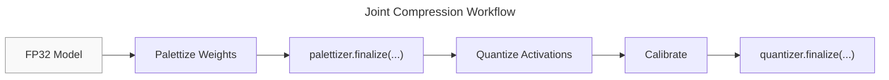

# Joint Compression

## Combining weight palettization with activation quantization

Palettization and Quantization can be applied together to compress both weights and activations in a single model.
The workflow uses the same `KMeansPalettizer` and `Quantizer` APIs covered in previous sections, applied sequentially in a specific order: palettize weights first, then quantize activations on the palettized model.

When combining palettization with activation quantization, the lookup table (LUT) entries should also be quantized to `INT8` via `lut_qspec`.
A floating-point LUT causes operations to execute in floating-point regardless of the activation quantization, whereas an `INT8` LUT allows the runtime to use the faster W_INT8-A_INT8 execution path where available.

For quantizing activations, `graph`-mode quantization is used (the default).

**Note**: Models compressed via the joint compression flow can currently only be finalized to the `Core AI` backend.



## Step 1: Palettize weights

Configure 4-bit palettization and run `prepare` to install fake-palettization parametrizations on the model weights.
`INT8` LUT quantization is specified using the `lut_qspec` argument in `PalettizationSpec`.

```python
import torch
import coreai_opt as opt
from coreai_opt.palettization import (
    KMeansPalettizer,
    KMeansPalettizerConfig,
    ModuleKMeansPalettizerConfig,
    PalettizationSpec,
)
from coreai_opt.quantization import QuantizationSpec
from coreai_opt.quantization.spec import QuantizationScheme

lut_qspec = QuantizationSpec(dtype=torch.int8, qscheme=QuantizationScheme.SYMMETRIC)
palett_config = KMeansPalettizerConfig(
    global_config=ModuleKMeansPalettizerConfig(
        op_state_spec={"weight": PalettizationSpec(n_bits=4, lut_qspec=lut_qspec)},
    ),
)

palettizer = KMeansPalettizer(model, palett_config)
palettizer.prepare(example_inputs)
```

## Step 2: Finalize the palettizer

Call `finalize` to replace the `FakePalettize` parametrizations with a `torch.export`-compatible representation.
This must happen before activation quantization is applied because `quantizer.prepare` uses `torch.export`, which cannot trace through the parametrizations.

```python
palettized_model = palettizer.finalize(backend=opt.ExportBackend.CoreAI)
```

## Step 3: Configure and prepare activation quantization

Apply the `Quantizer` to the already-palettized model.
Set `op_state_spec=None` to disable weight quantization — weights are already compressed via palettization, so applying quantization on top would be redundant.
Use a representative data sample for `example_inputs` to provide a reasonable starting point for activation quantization parameters.

```python
from coreai_opt.quantization import (
    ModuleQuantizerConfig,
    Quantizer,
    QuantizerConfig,
)

act_spec = QuantizationSpec(dtype=torch.int8, qscheme=QuantizationScheme.SYMMETRIC)
quant_config = QuantizerConfig(
    global_config=ModuleQuantizerConfig(
        op_state_spec=None,
        op_input_spec={"*": act_spec},
        op_output_spec={"*": act_spec},
    ),
)

quantizer = Quantizer(palettized_model, quant_config)
prepared_model = quantizer.prepare(example_inputs)
```

## Step 4: Calibrate

Run representative data through the prepared model inside `calibration_mode` to collect activation statistics used to compute quantization scales.

```python
with quantizer.calibration_mode():
    for batch in calibration_dataloader:
        prepared_model(batch)
```

## Step 5: Finalize

Call `quantizer.finalize` to convert fake-quantization ops into backend-specific representations.
The model is then ready to be exported for downstream conversion with `coreai-torch`.
Refer to [Integration with Core AI](../introduction/integration_coreai.md) for more details.

```python
final_model = quantizer.finalize(backend=opt.ExportBackend.CoreAI)
```

## Notes

- For a working end-to-end example, see `test_p4a8_compression_mnist_accuracy` in `tests/test_joint_compression.py`.
- For export-related tests, see `test_mnist_p4a8_compression_export` in `tests/export/test_pt2e_mlir_export.py`.
- We explore applying joint compression to the EDSR model [here](../examples/edsr.md).
